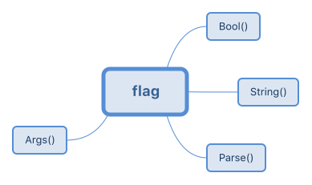

# flag

flag 包用来读取命令行参数。比如：

```go
package main

import (
    "flag"
    "fmt"
    "strings"
)

var n = flag.Bool("n", false, "omit trailing newline")
var sep = flag.String("s", " ", "separator")

func main() {
    flag.Parse()
    fmt.Println(strings.Join(flag.Args(), *sep))
    if !*n {
        fmt.Println()
    }
}
```

其中的 `n` 和 `sep` 均为指针，分别指向布尔类型和字符串类型。

必须首先调用 `flag.Parse()`，才能在函数中使用命令行参数。非命令行参数可以通过 `flag.Args()` 获取，它的类型是字符串切片。

常用函数总结如下：

